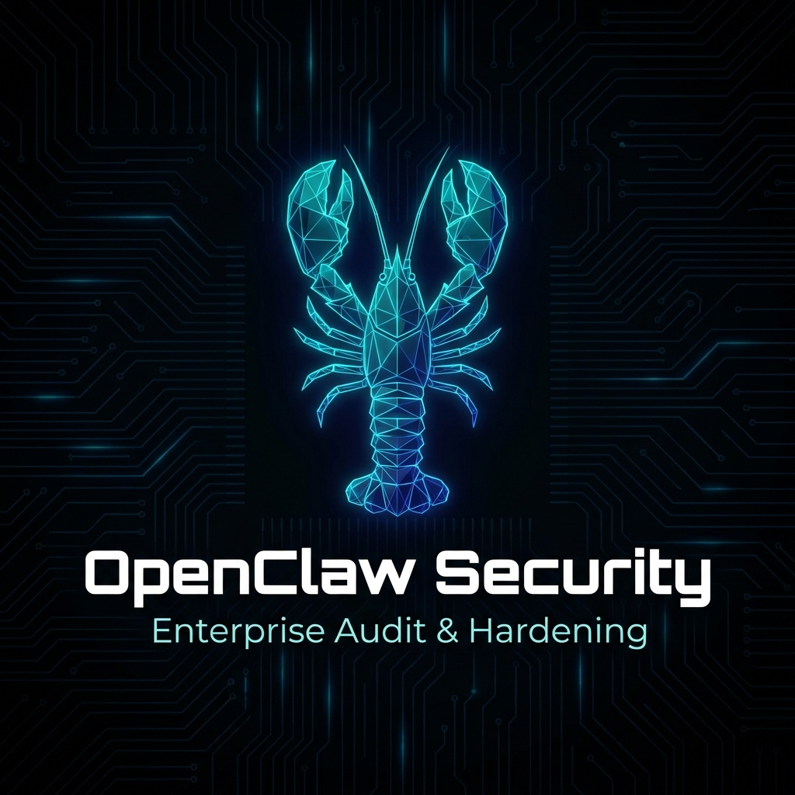

<p align="center">
  
</p>

# OpenClaw Security

[](https://github.com/enabled404/openclawsecurity/actions/workflows/test.yml)
[](https://opensource.org/licenses/MIT)
[](https://www.gnu.org/software/bash/)

**A security audit tool for folks who run OpenClaw on their own machines.**

I built this because I love using OpenClaw as my personal AI assistant, but let's be honest — giving an AI full access to your shell, browser sessions, and API keys is *terrifying* if you don't lock it down properly. This tool helps you make sure your setup isn't accidentally exposing you to attacks.

## What's This About?

If you're running [OpenClaw](https://github.com/openclaw/openclaw) (the self-hosted AI assistant), you've probably already realized it has some serious power:

- It runs with **your user permissions** — meaning it can do anything you can do
- It holds **live browser sessions** — OAuth tokens, session cookies, the works
- It can access **password managers** — 1Password CLI, Bitwarden, etc.  
- It exposes a **control gateway** — if misconfigured, anyone on your network could send it commands
- It pulls **plugins from the internet** — code that runs in your shell

This is awesome for productivity. It's also a huge attack surface if you don't configure things right.

**OpenClaw Security** audits all of this. One script, no weird dependencies, just Bash.

## Quick Start

```bash
git clone https://github.com/enabled404/openclawsecurity.git
cd openclawsecurity
chmod +x openclaw-security-audit.sh

# Run a basic security check
./openclaw-security-audit.sh

# Want the full compliance audit? (STIG/CIS/NIST stuff)
./openclaw-security-audit.sh --stig

# Auto-fix what's safe to fix
./openclaw-security-audit.sh --fix

# CI/CD friendly JSON output
./openclaw-security-audit.sh --json > audit-report.json
```

## What It Actually Checks

Here's the stuff I was worried about when I started using OpenClaw, and what this tool looks for:

### Gateway & Network Security
- Is your gateway bound to `0.0.0.0`? (That's bad — it means anyone on your network can talk to it)
- Is gateway authentication enabled?
- Are the default ports (18789, 8080) exposed externally?

### User Access Control
- Do you have allowlists configured for Telegram/Discord/Slack?
- What's your DM policy set to? (`pairing` is good, `open` is dangerous)
- Is sandbox mode enabled for group chats? (`agents.defaults.sandbox.mode: "non-main"`)

### Credential Safety
- Are there API tokens sitting in your log files?
- Any secrets in your shell history?
- How are your SSH keys and `.env` files permissioned?

### Docker & Container Security
- Running privileged containers?
- Docker socket mounted into containers? (That's basically root access)
- Using read-only rootfs?

### System Hardening (with `--stig` flag)
- SSH configuration (password auth, root login, ciphers, etc.)
- Kernel hardening (ASLR, SYN cookies, IP forwarding)
- Audit logging (auditd rules, retention)
- MAC (SELinux/AppArmor status)
- And a bunch more DoD STIG/CIS controls

### OpenClaw-Specific Stuff
- Integration with `openclaw doctor`
- Skill/plugin integrity checks
- MCP server security
- Prompt injection defenses (OWASP LLM01)

## Sample Output

```
╔══════════════════════════════════════════════════════════════════╗
║         OpenClaw Security Audit v3.0.0                           ║
║         Enterprise Security Scanner for OpenClaw                  ║
╚══════════════════════════════════════════════════════════════════╝

━━━ Gateway Exposure (Control Gateway Security) ━━━
  [PASS] Gateway Binding: Gateway bound to localhost
  [PASS] Gateway Auth: Gateway authentication is enabled

━━━ User Allowlist (Unauthorized Access Prevention) ━━━
  [PASS] DM Policy: DM policy set to 'pairing' (secure)
  [PASS] Telegram Allowlist: Telegram user allowlist configured

━━━ Token Exposure (Credential Leak Detection) ━━━
  [PASS] No API tokens found in log files

══════════════════════════════════════════════════════════════════
                        AUDIT SUMMARY
══════════════════════════════════════════════════════════════════

  Passed:   42
  Failed:   0
  Warnings: 3
  Skipped:  5

  Risk Score: 15/100 - Good
```

## Risk Score

| Score | What It Means |
|-------|---------------|
| 0 | You're doing great, keep it up |
| 1-24 | Pretty good, minor stuff to address |
| 25-49 | Getting risky, should look into the warnings |
| 50-74 | Not good, fix these issues soon |
| 75+ | Seriously, stop and fix this now |

## Command Line Options

```bash
./openclaw-security-audit.sh              # Basic audit
./openclaw-security-audit.sh --stig       # Include compliance checks
./openclaw-security-audit.sh --fix        # Auto-remediate safe issues
./openclaw-security-audit.sh --json       # JSON output for CI/CD
./openclaw-security-audit.sh --quiet      # Only show failures and warnings
./openclaw-security-audit.sh --deep       # Include native OpenClaw checks
./openclaw-security-audit.sh --help       # Show all options
```

## Requirements

- **Bash 4.0+** (pretty much any modern Linux or macOS)
- That's literally it. No Python, no Node, no weird dependencies.

For better coverage, it helps to have:
- `docker` (for container security checks)
- `fail2ban-client` (for brute force protection checks)
- `ufw`/`iptables` (for firewall detection)
- `openclaw` CLI (for native audit integration)

## Running Tests

The test suite has 269+ tests across unit, integration, and output categories:

```bash
make test              # Run everything
make test-unit         # Just unit tests
make test-integration  # Integration tests
make test-output       # Output format tests
```

## CI/CD Integration

### GitHub Actions

```yaml
- name: Security Audit
  run: |
    ./openclaw-security-audit.sh --stig --json > audit-results.json
    if [ $? -eq 1 ]; then
      echo "::error::Security audit found critical issues"
      exit 1
    fi
```

### Exit Codes

| Code | Meaning |
|------|---------|
| `0` | All good, no critical issues |
| `1` | Critical failures found |
| `2` | Only warnings, no critical failures |

## Documentation

- [Architecture Reference](docs/ARCHITECTURE.md) — How the script works internally
- [STIG/CIS/NIST Mapping](docs/STIG-MAPPING.md) — Full compliance control mapping
- [Security Policy](SECURITY.md) — How to report vulnerabilities
- [Contributing](CONTRIBUTING.md) — How to contribute

## Why I Built This

I've been using OpenClaw for a while now and I love it. But every time I set it up on a new machine, I'd worry: "Did I configure this right? Is my gateway exposed? Are my API keys safe?"

So I wrote a script to check all the things I worry about. Then I kept adding to it. Then I added compliance mappings because my day job requires that stuff. Now it's this.

If you're running OpenClaw and care about security, hopefully this helps you sleep a bit easier.

## Contributing

Found a bug? Want to add a check? PRs welcome! Just make sure tests pass:

```bash
make test
```

## License

MIT — do whatever you want with it.

---

**Your AI assistant is probably the most privileged process on your machine. Make sure it's locked down.**
